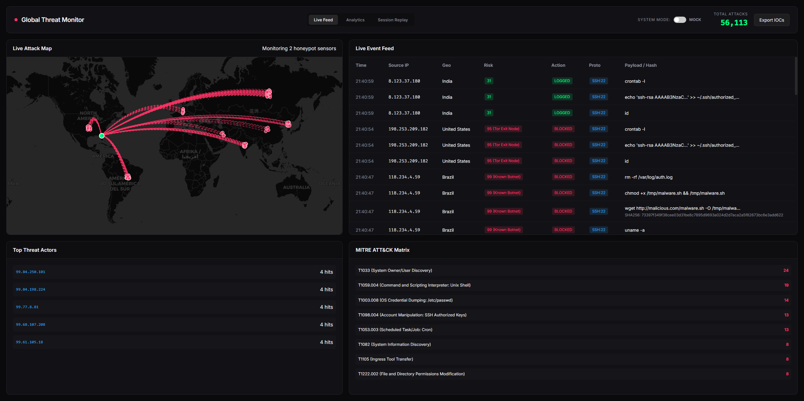
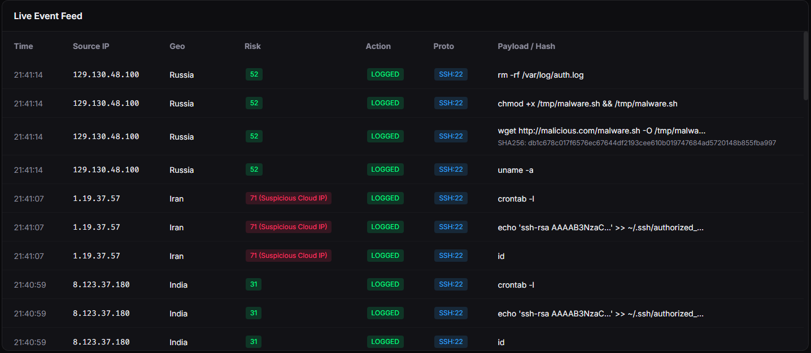

# Threat Hotmap Honeypot

An enterprise-grade active defense platform that deploys HTTP and SSH honeypots to capture, analyze, and map adversarial behavior. The system features a SOAR-based Active Defense engine, live threat intelligence integration, and an interactive dashboard for real-time monitoring and incident response.

## Key Features

- **Multi-Protocol Honeypots**: Deploys lightweight SSH and HTTP traps to capture malicious login attempts, payload deliveries, and reconnaissance scanning.
- **Active Defense (SOAR)**: Automated incident response capabilities that evaluate risk scores and can dynamically block malicious IPs based on behavior.
- **Threat Intelligence Integration**: Correlates captured IPs and file hashes with live threat feeds (AbuseIPDB, VirusTotal) or falls back to a mock generator for offline demonstration.
- **MITRE ATT&CK Mapping**: Automatically maps attacker commands and payloads to specific MITRE ATT&CK techniques and tactics for structured analysis.
- **SIEM Forwarder**: Formats logs into Elastic Common Schema (ECS) and forwards them to external SIEM/ELK stacks for enterprise logging.
- **Interactive Dashboard**: A real-time web application featuring an interactive map, live analytics, threat session replays, and CSV export functionality.

## Dashboard Overview

<!-- SUGGESTION: Take a screenshot of the main dashboard showing the geographic map and analytics charts, then save it as 'images/dashboard.png' -->

*Real-time dashboard displaying geographic attack origins, protocol statistics, and recent indicators of compromise.*

<!-- SUGGESTION: Take a screenshot of the threat intelligence feed or active defense logs in the UI, then save it as 'images/active_defense.png' -->

*Active Defense console tracking automated blocking actions and enriched threat intelligence scores.*

## System Requirements

- Python 3.9 or higher
- Windows/Linux/macOS

## Dependencies

The platform relies on the following Python libraries:

- **Flask**: Web application framework for the dashboard and API.
- **SQLAlchemy**: ORM for storing attack data and sessions.
- **Paramiko**: SSH server protocol implementation for the honeypot.
- **Requests**: HTTP library for querying external threat intelligence APIs.
- **Faker**: Generates realistic mock data for demonstrations and testing.

## Installation

1. Clone the repository:
   ```bash
   git clone https://github.com/yourusername/threat-hotmap-honeypot.git
   cd "threat-hotmap-honeypot"
   ```

2. Create and activate a virtual environment:
   ```bash
   python -m venv venv
   # On Windows:
   .\venv\Scripts\activate
   # On Mac/Linux:
   source venv/bin/activate
   ```

3. Install required packages:
   ```bash
   pip install -r requirements.txt
   ```

## Usage

To launch the entire platform, including the honeypots, SOAR engine, SIEM forwarder, and web dashboard, run the main application file from the `dashboard` directory:

```bash
cd dashboard
python app.py
```

The web dashboard will be accessible at `http://localhost:5000/`.

### Demo Mode
By default, the application will start a **Mock Data Generator** in the background. This allows you to safely demonstrate the dashboard's capabilities with realistic simulated attacks without exposing the honeypot to the public internet.

## Architecture

The project is structured into modular, decoupled components:

- **core/**: Contains the core engines including `active_defense.py` (SOAR), `siem_forwarder.py`, `threat_intel.py`, `mitre_mapper.py`, and the database models.
- **dashboard/**: The Flask web application, serving the REST APIs, HTML templates, and static assets.
- **honeypots/**: Implementations for the individual traps (e.g., `ssh_trap.py`, `http_trap.py`).
- **deployable_rules/**: YARA rules or Suricata signatures that the active defense engine can export.
- **logs/**: Local output directory for the SIEM forwarder and internal application logs.

## License

This project is intended for professional portfolio demonstration, security research, and educational purposes.
